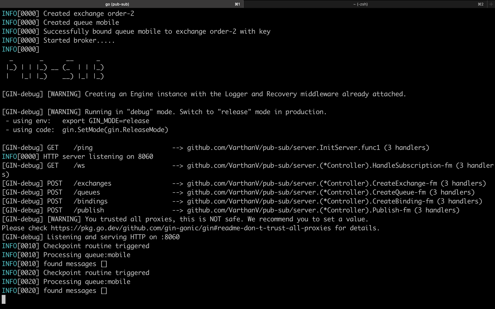

# 🚀 Pub-Sub : A toy Messaging System

A toy real-time Pub-Sub messaging system with durable queues, dynamic routing, and WebSocket support for seamless communication. 🌐🚀

# Pipeline

- Minimal frontend (WIP)

- Client and server libraries in Go to interact with this stack

- Lock-free datastructures to reduce contention and increase throughput.


## ⚡ Project Layout

```bash
├── README.md
├── assets
│   └── working.png
├── binding
│   └── binding.go
├── broker
│   ├── helpers.go
│   └── main.go
├── errors
│   └── main.go
├── exchange
│   └── main.go
├── go.mod
├── go.sum
├── image.png
├── main.go
├── messages
│   └── message.go
├── models
│   ├── base.go
│   ├── binding.go
│   ├── exchange.go
│   ├── message.go
│   └── queue.go
├── pkg
│   ├── config
│   │   └── config.go
│   └── database
│       └── database.go
├── pub-sub.db
├── queue
│   ├── main.go
│   └── main_test.go
└── server
    ├── binding.go
    ├── controller.go
    ├── exchange.go
    ├── main.go
    ├── publish.go
    ├── queue.go
    ├── routes.go
    └── subscription.go

13 directories, 30 files
```

## 🌟 Features

### 🛠️ Core Functionalities
- **Exchange Management**: Supports multiple exchange types, including `FanOut` and `Direct`, to route messages effectively.
- **Queue Management**: Durable and non-durable queues for persistent or transient message storage.
- **Dynamic Bindings**: Bind queues to exchanges with flexible routing keys.
- **WebSocket Subscriptions**: Real-time updates with WebSocket-based subscription mechanisms.
- **Message Persistence**: Persist messages for durable queues to ensure reliability and fault tolerance.

### ⚡ Built for Performance
- Lightweight and highly concurrent architecture using **Go's goroutines** and **sync primitives**.
- **Semaphore-based worker control** for concurrent operations like real-time updates and database syncing.
- Optimized database interactions with **GORM**, including bulk inserts and conflict handling.

### 💾 Database-Driven
- Persistent state management with a relational database for exchanges, bindings, and queues.
- Preloaded relationships (`Preload("Bindings.Queues")`) to minimize query overhead.
- Many-to-many relationships with **GORM's advanced association handling**.

### 🔄 Real-Time Data Flow
- Publish-Subscribe pattern implemented with efficient routing algorithms.
- FanOut messages to all bound queues or Direct messages to specific routing keys.
- Seamless WebSocket integration to notify subscribers in real time.

## 📚 Tech Stack
- **Go**: A blazing-fast, statically typed language perfect for concurrent systems.
- **GORM**: ORM for seamless database interactions and relationship management.
- **WebSocket**: Enables real-time communication between broker and clients.
- **PostgreSQL/MySQL**: Supported as the database backend for reliable persistence.
- **Logrus**: Enhanced logging for debugging and system monitoring.

## 🔧 How It Works

### 🎯 Core Models
1. **Exchange**: Acts as a router for messages. Each exchange can have:
   - A `FanOut` type for broadcasting messages to all bound queues.
   - A `Direct` type for routing messages based on a key.
   
2. **Queue**: Stores messages for consumers, with options for:
   - Durability to survive broker restarts.
   - Non-durability for lightweight, temporary storage.

3. **Binding**: Connects an exchange to one or more queues with a routing key.

### 🌀 Broker Lifecycle
1. **Startup**:
   - Loads exchanges, bindings, and queues from the database.
   - Rebuilds in-memory mappings for fast runtime operations.

2. **Publish**:
   - Routes messages based on exchange type and routing key.
   - Supports concurrent publishing with **Go routines**.

3. **Subscribe**:
   - Real-time updates via WebSocket connections for bound queues.

4. **Checkpointing**:
   - Periodic database synchronization to persist messages for durable queues.

## 🎉 Why You'll Love This
- 🌐 **Scalable**: Handles high throughput and concurrency with ease.
- 🔒 **Reliable**: Durable message storage ensures no data loss.
- 🧩 **Extensible**: Add new exchange types or integrate with other services effortlessly.
- 🛠️ **Developer-Friendly**: Clean architecture and logs make debugging a breeze.

## 🏁 Getting Started

### 🔨 Prerequisites
- **Go** (1.18+)
- **PostgreSQL/MySQL**
- **Docker** (optional, for containerized deployment)

### 🚀 Run the Broker
```bash
git clone https://github.com/VarthanV/pub-sub.git
cd pub-sub
go run main.go
```


## Screenshots




## 📄 License
This project is licensed under the **MIT License**. Feel free to use, modify, and distribute as needed.

